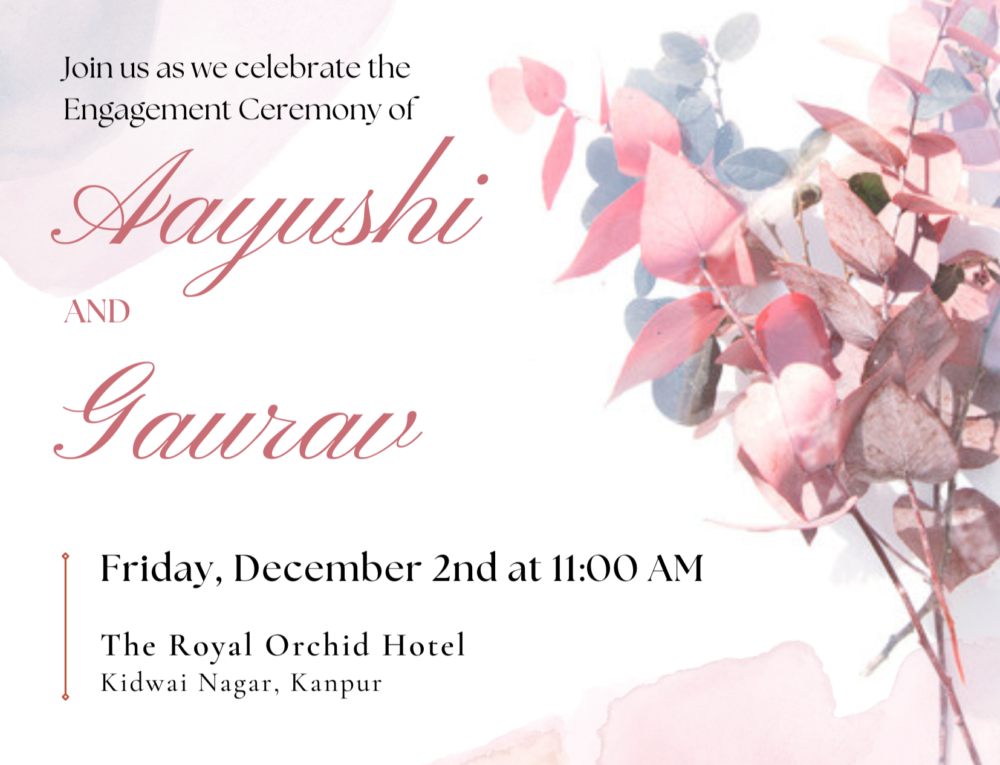

<h1 align = "center"><b><i>Engagement Ceremony Invitation</i></b></h1>

  
##

It gives me an immense pleasure to disclose that my lovely elder sister is getting engaged on **Friday, 2nd December, 2022** at **The Royal Orchid Hotel, Kidwai Nagar, Kanpur**. For the sake of convinience of our guests, I've created a invitation site which carries following details -

- Date and Time of an event

- Google Maps [Location](https://maps.app.goo.gl/DVfkKzF2ZFZvmn1M8) of the Venue

- Invitation Card

  
<strong>View Invitation</strong>

  

##

Code Credits - [Vinit Shahdeo](https://github.com/vinitshahdeo)

Song Credits - [Din Shagna Da](https://www.youtube.com/watch?v=X0MDALpV29s) by Jasleen Royal
